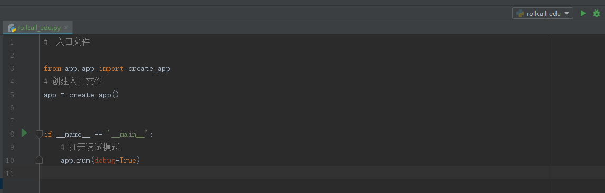

# Flask基础教程

## 先决条件

请先配置[Python基本开发环境](./[python]-1-Python-开发环境配置指南.md)。

## 创建Flask框架hello,world

1. 新建项目目录 `rollcall_edu` 。

2. 把[Pipfile](https://github.com/smuport/flask-rollcall-edu/blob/master/Pipfile)拷贝到该目录下

3. 使用Pycharm打开包含[Pipfile](https://github.com/smuport/flask-rollcall-edu/blob/master/Pipfile)的文件夹，牛P的Pycharm会自动创建环境

4. 在目录下新建[rollcall_edu](https://github.com/smuport/flask-rollcall-edu/blob/master/rollcall_edu.py)的入口文件

5. 在目录下新建app包，以后写的核心代码都放置在该包内

6. 在app包中新建[app.py](https://github.com/smuport/flask-rollcall-edu/blob/master/app/app.py)文件，在该文件中主要操作Flask核心对象

7. 新建路由文件，如[hello.py](https://github.com/smuport/flask-rollcall-edu/blob/master/app/api/hello.py),在该文件及其他路由文件中主要进行业务处理，前台交互等工作

8. 恭喜你，成功完成一个接口的实现，现在请选中入口文件，点击运行

  ​

9.运行后，请在postman中发送请求测试，恭喜你成功调用

[demo 视频链接](https://pan.baidu.com/s/1a3ew8oxn4YDiTH4neVpWfA )