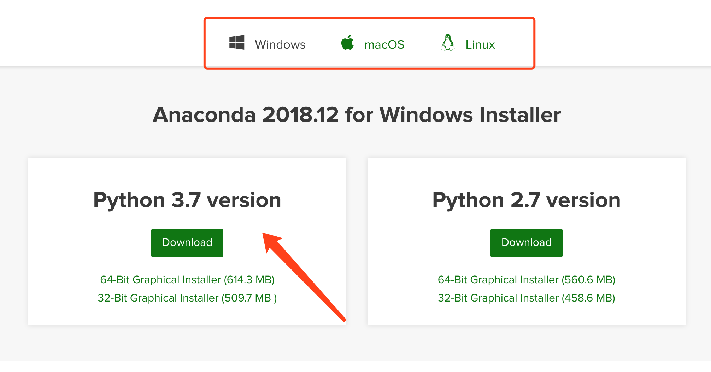
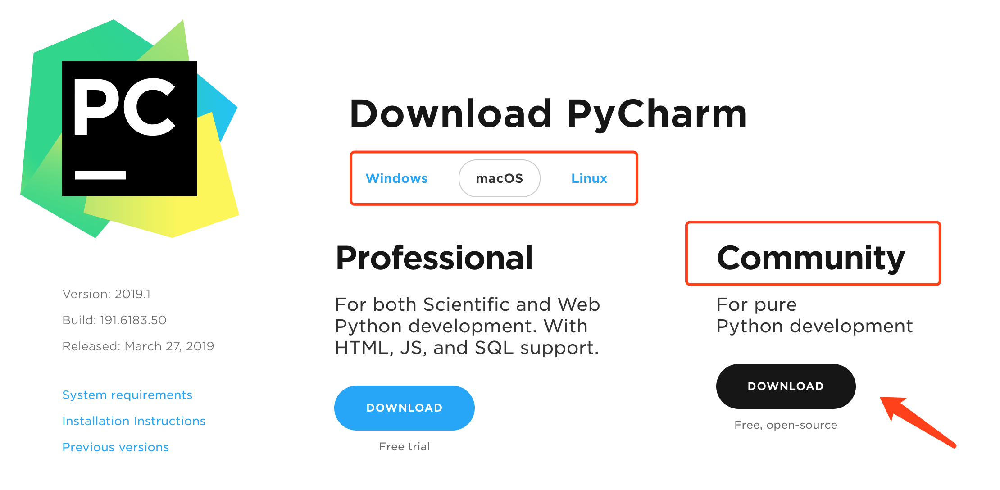
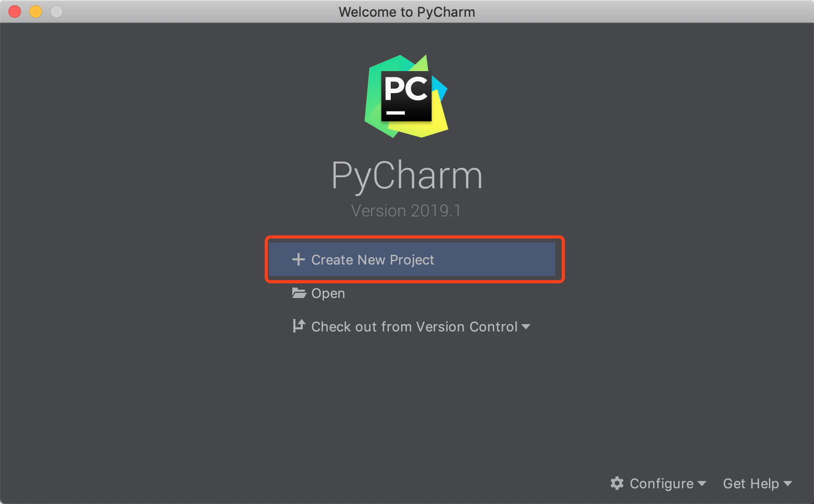
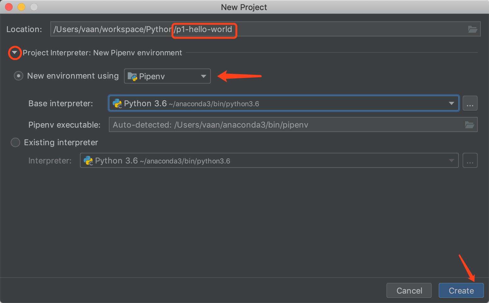
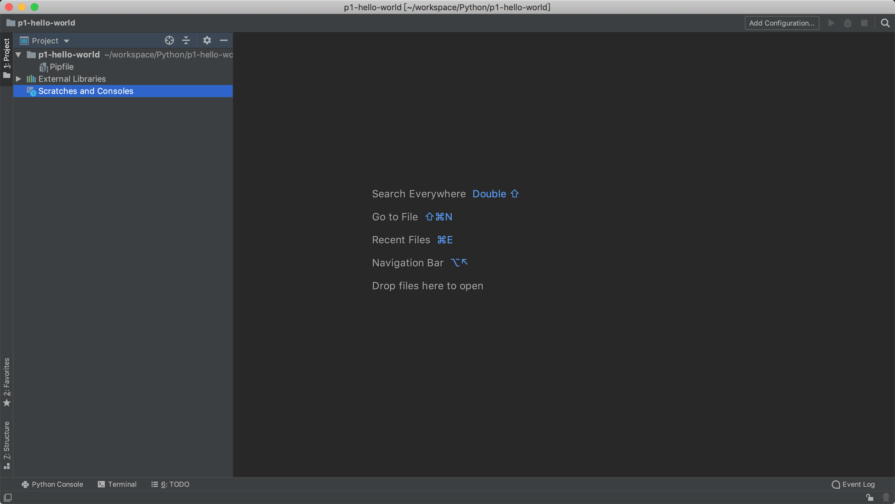
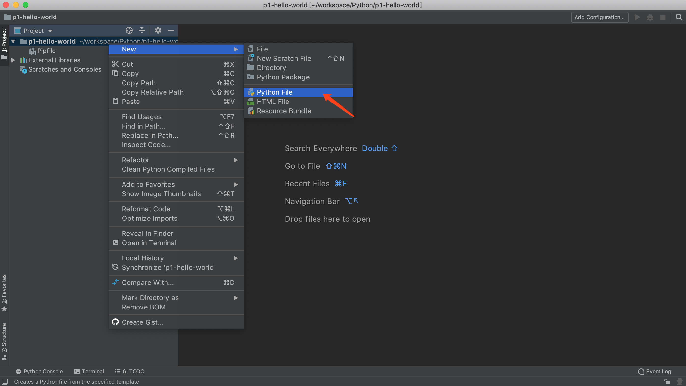
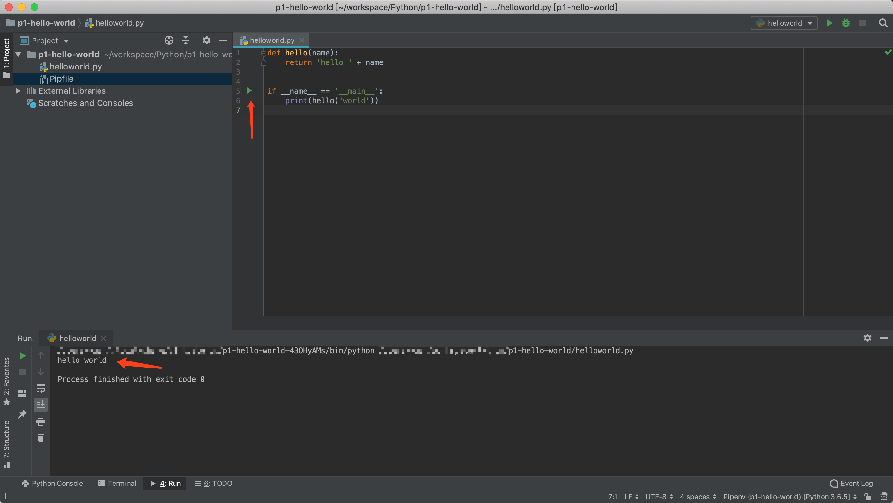

# Python 开发环境配置指南

## Anaconda3 安装

### 下载 Anaconda

Anaconda 是一个开源Python发行版，提供了python包管理、独立环境创建等非常实用的python开发辅助功能。

下载地址：https://www.anaconda.com/distribution/

**请选择自己的操作系统，并下载Anaconda Python3.7 版本**

### 安装 pipenv

pipenv 是一个强大的 Python 包管理以及虚拟环境管理工具。它能自动地为你的项目创建并管理一个 Python 虚拟环境，同时能通过 `Pipfile` 方便的添加和删除所使用的 Python 包。

可使用以下命令行安装 pipenv。

~~~bash
pip install pipenv
~~~

## PyCharm Community 集成开发环境安装

下载地址：https://www.jetbrains.com/pycharm/download/

**请选择自己的操作系统，并下载PyCharm Community版**

## 创建第一个 Python 工程: Hello World

打开PyCharm, 点击 **Create New Project** 新建Python工程。

- 将项目名称改为`p1-hello-world`；

- 展开 Project Interpreter 设置；
- 选择使用 **Pipenv** 创建新的 Python 虚拟环境；
- ⚠️注意：文档中 **Base interpreter** 为 Python 3.6，但其实际值与操作系统中默认Python环境版本相关，只要是 Python3 以上版本即可，**推荐选择 Python3.6+** 的 Base interpreter；
- 点击 **Create** 创建项目；

等待片刻，项目创建完成后出现如下界面。

- 界面左侧为**项目文件结构树**

- 界面右侧为**工作区**

在`p1-hello-world`目录上点击右键选择创建一个 **Python File**，并命名为 *helloworld*。

双击打开新建的 **helloworld.py** 文件，并添加以下代码：

~~~python
def hello(name):
    return 'hello ' + name

if __name__ == '__main__':
    print(hello('world'))
~~~

点击**运行**按钮执行程序，控制台打印出了程序执行结果。

